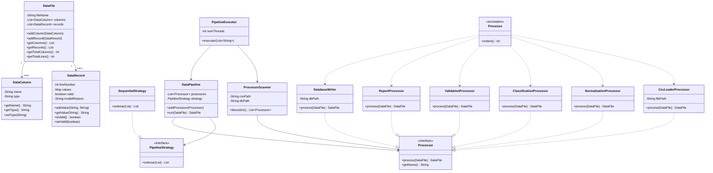

# Diagrama de Classes — Data Processing Engine

```mermaid
classDiagram
    class DataFile {
        -String fileName
        -List~DataColumn~ columns
        -List~DataRecord~ records
        +addColumn(DataColumn)
        +addRecord(DataRecord)
        +getColumns() List
        +getRecords() List
        +getTotalColumns() int
        +getTotalLines() int
    }

    class DataColumn {
        -String name
        -String type
        +getName() String
        +getType() String
        +setType(String)
    }

    class DataRecord {
        -int lineNumber
        -Map values
        -boolean valid
        -String invalidReason
        +addValue(String, String)
        +getValue(String) String
        +isValid() boolean
        +setValid(boolean)
    }

    class Processor {
        <<interface>>
        +process(DataFile) DataFile
        +getName() String
    }

    class PipelineStrategy {
        <<interface>>
        +ordenar(List) List
    }

    class SequentialStrategy {
        +ordenar(List) List
    }

    class DataPipeline {
        -List~Processor~ processors
        -PipelineStrategy strategy
        +addProcessor(Processor)
        +run(DataFile) DataFile
    }

    class ProcessorScanner {
        -String csvPath
        -String dbPath
        +descobrir() List~Processor~
    }

    class PipelineExecutor {
        -int numThreads
        +executar(List~String~)
    }

    class CsvLoaderProcessor {
        -String filePath
        +process(DataFile) DataFile
    }

    class NormalizationProcessor {
        +process(DataFile) DataFile
    }

    class ClassificationProcessor {
        +process(DataFile) DataFile
    }

    class ValidationProcessor {
        +process(DataFile) DataFile
    }

    class ReportProcessor {
        +process(DataFile) DataFile
    }

    class DatabaseWriter {
        -String dbPath
        +process(DataFile) DataFile
    }

    class Processo {
        <<annotation>>
        +ordem() int
    }

    DataFile "1" --> "many" DataRecord
    DataFile "1" --> "many" DataColumn
    DataPipeline --> PipelineStrategy
    DataPipeline --> Processor
    SequentialStrategy ..|> PipelineStrategy
    CsvLoaderProcessor ..|> Processor
    NormalizationProcessor ..|> Processor
    ClassificationProcessor ..|> Processor
    ValidationProcessor ..|> Processor
    ReportProcessor ..|> Processor
    DatabaseWriter ..|> Processor
    ProcessorScanner --> Processor
    PipelineExecutor --> ProcessorScanner
    PipelineExecutor --> DataPipeline
    Processo ..> CsvLoaderProcessor
    Processo ..> NormalizationProcessor
    Processo ..> ClassificationProcessor
    Processo ..> ValidationProcessor
    Processo ..> ReportProcessor
    Processo ..> DatabaseWriter
```